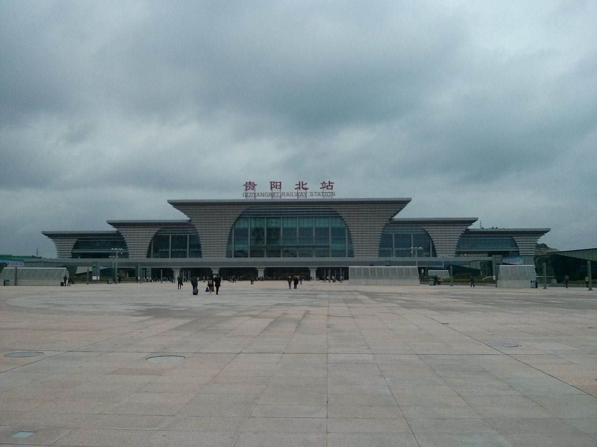
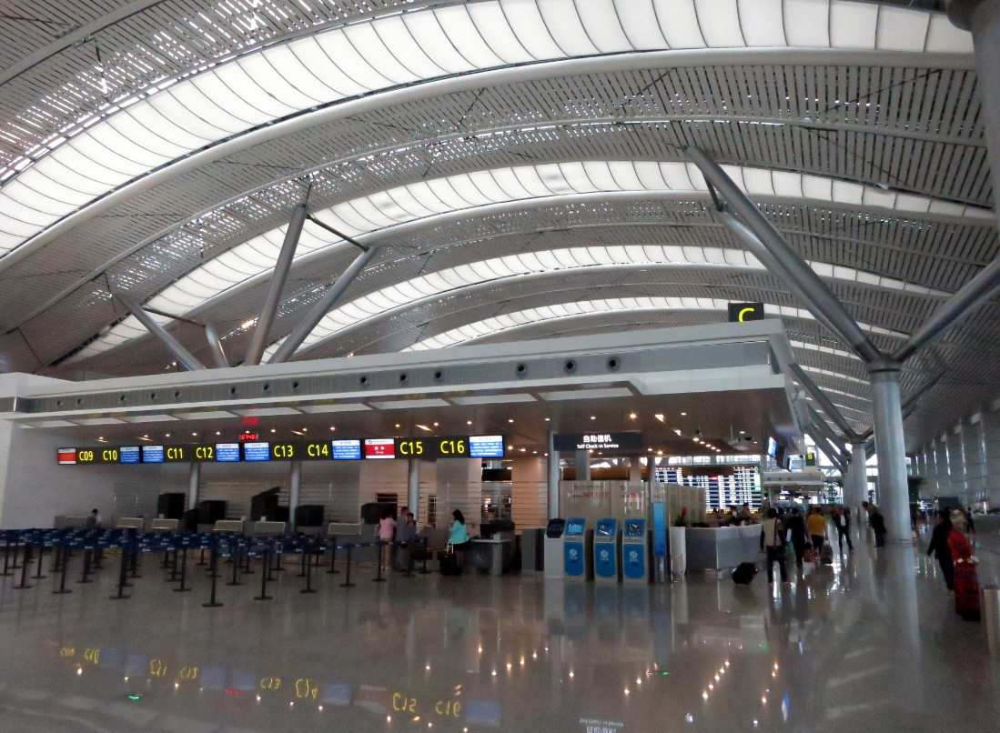
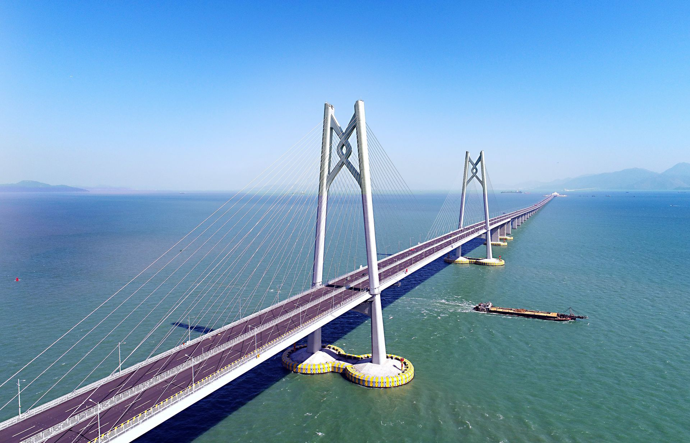
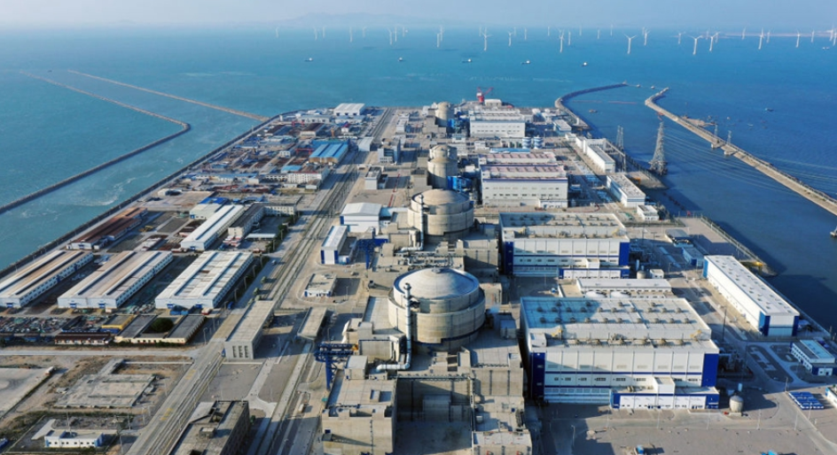
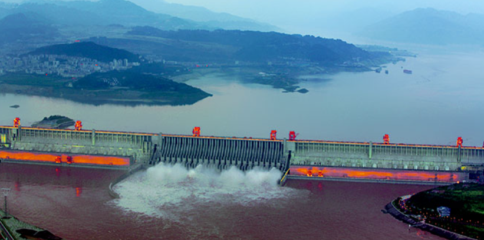
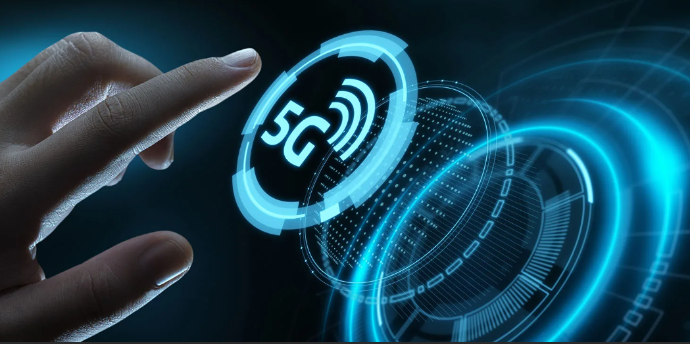

### 作品主题

以学习贯彻党的二十大精神为主题，参赛作品重点体现**新时代十年取得的伟大成就**。将党对青年一代的殷切期望和深切关怀和身边先进典例、青年榜样的成长故事相结合，通过个人成长发展映射社会发展成就，感悟在中国共产党的坚强领导下，在脱贫攻坚、人民生活、社会发展等方面带来的巨变。要求内容积极向上，主题鲜明，作品呈现简明扼要，有**相应数据支撑**，作品外观**整洁**具有一定**艺术性**与**创新性**

### 截止时间

**5月28号**

### 作品提交

网页赛道：计算机科学与技术学院提交至[2031337411@qq.com](mailto:2031337411@qq.com)

其他学院提交至2898954112@qq.com

### 评分细则

1. 规范性：作品选题符合要求、格式规范、数据信息与语言表达准确、结构完整、主题突出。【20分】
2. 技术性：作品内容呈现具有一定的层次性，功能结构设计合理,技术手段要求较高，具备一定的数据建模能力和数据整理能力。【20分】
3. 可视性：**可视化程度较高**，直观，易于理解，画面流畅，能清晰、有效的进行信息传递。【30分】
4. 创新性：构思有创意、表达方式有新意、技术手段与方法有创新，能够为解决实际工作问题提供决策方案。【20分】
5. 艺术性：美观、优雅，具有冲击力和说服力，是科学、艺术和设计的较好结合。【10分】

### 具体思路

#### TODO(不分先后)

1. ~~移动端css适配~~ 没有完成，暂时改为跳转网页

2. ~~社会发展section内容填充和待定~~ 已完成√

3. 404页面

4. 美化字体和css

6. 精简html
7. ~~首页向下小箭头~~ 已完成√

总共四页，一个首页，三个板块

- 首页：比较漂亮的动态的展现主题（首页）

- 脱贫攻坚：使用原有的（板块1）

- 人民生活：收入，出行（板块2）

  - 收入：用原来的网页里面的贵州省板块跳转

  - 出行交通：

    这十年，我国交通运输事业取得历史性成就、发生历史性变革，迎来由交通大国向交通强国的历史性跨越。

    **综合交通网突破600万公里**

    公路广泛覆盖。“目前，高速公路通车里程超过16万公里。公路网密度达到每百平方公里55公里，比2012年增长24.6%。”徐成光告诉记者，十年来，我国累计新建改建农村公路约253万公里，解决了1040个乡镇、10.5万个建制村通硬化路的难题；农村公路总里程从2011年底的356.4万公里增加到2021年底的446.6万公里，增加90多万公里。

    民航快速发展。董志毅表示，这十年，民航新建、迁建运输机场82个，机场总数达到250个，新增航线3000余条，航线总数达到5581条，“在脱贫地区新建运输机场47个，航空服务对脱贫地区的人口覆盖率达到83.6%，比2012年增加13个百分点。”

    水运基础设施体系加速完善。徐成光介绍，到2021年底，我国内河航道的通航里程达12.8万公里，其中高等级航道超过1.6万公里，拥有生产用码头泊位20867个，其中万吨级及以上泊位2659个，基本形成了长三角、津冀、粤港澳等世界级港口群。

    配图：

    贵阳北站：

    

    龙洞堡机场：

    

    港珠澳大桥：

    

- 社会发展：基础设施，公共服务

  - 能源电力

    在确保能源安全可靠供应的前提下，我国持续推进能源结构清洁化、低碳化转型。如今，我国可再生能源发电装机规模突破10亿千瓦，绿色电力装机总量稳居世界第一；2021年底，风电光伏并网装机合计6.35亿千瓦，是2012年的近90倍。

    配图：

    

  - 民生工程

    十年前，在河北邯郸、邢台等一些地方，农村饮水氟超标问题还很严重，苦咸水、高氟水是不少百姓的心病。2014年底，南水北调中线一期工程全面通水。清澈的江水从位于汉江中上游的丹江口水库北上，流经上千公里，为极度缺水的华北地区带来甘霖。作为世界规模最大的调水工程之一，南水北调在建设中利用了明渠、渡槽、隧洞等多种技术，打造了世界最大输水渡槽、世界最大规模现代化泵站群。通水以来，南水已成为北京、天津、河北、河南等地40多座大中城市280多个县（市、区）超过1.4亿人的主力水源。数据统计，截至今年5月13日，南水北调东线和中线工程累计调水量达531亿立方米，为沿线50多条河流实施生态补水85亿立方米，为受水区压减地下水超采量50多亿立方米。现在，南水北调受水区的家庭只要一打开水龙头，就能喝到千里外的长江水。2018年以来，党中央部署农村人居环境整治行动，推进农村“厕所革命”，完善农村生活设施。截至2021年底，全国农村卫生厕所普及率超过70%，其中，东部地区、中西部城市近郊区等有基础、有条件的地区农村卫生厕所普及率超过90%。此外，目前全国范围内农村生活垃圾进行收运处理的自然村比例稳定保持在90%以上。

    配图：

    

  - 数字通讯

    2012年全国移动电话基站数刚刚突破200万个，到2021年末，这一数字达到了996万个。目前，我国已历史性实现全国行政村“村村通宽带”，宽带网络平均下载速率提高近40倍，4G基站规模占全球总量的一半以上，建成5G基站达到161.5万个。

    互联网在生产领域的应用也正在加速拓展深化。截至目前，我国工业互联网高质量外网覆盖全国300多个城市，培育较大型工业互联网平台超150家、连接工业设备超过7800万台（套），工业互联网应用已覆盖45个国民经济大类。这样的“数字基建”不仅是数字经济发展的基石，更成为优化经济结构、促进经济中长期可持续发展的重要引擎。

    作为数字经济发展的核心生产力，算力已成为国民经济发展的重要基础设施。今年以来，全国10个国家数据中心集群中，新开工项目25个，带动各方面投资超过1900亿元。

    2022年2月，“东数西算”工程正式全面启动，通过将东部发达地区的数据，传输到西部算力资源丰富的地区进行运算、存储，既缓解了东部能源紧张的问题，也给西部开辟出一条发展新路。

    目前，从中央到地方，包括5G基站、工业互联网、数据中心在内的新基建项目仍在扎实推进中。未来，我国还将全面加强信息基础设施建设，扩大5G网络覆盖深度，加快5G等新兴技术规模化应用，助力经济高质量发展和民生持续改善。 

    配图：

    

  

思路二：成就展示板块

按照党的二十大精神和新时代取得的伟大成就，设计不同的展示板块。每个板块可以以某个领域为主题，如脱贫攻坚、人民生活改善、科技创新等，重点展示相关成就和数据。通过文字、图片、图表等元素的组合，清晰展现该领域在新时代取得的巨变和进步。同时，为了增加艺术性和创新性，可以运用动态效果、交互式展示等技术手段，使得整个作品更具吸引力和互动性。	

1. 中华民族伟大复兴的中国梦：
   - 主题：实现中国梦的总体布局和战略布局
   - 子主题：五位一体总体布局和四个全面战略布局的内涵与实施
   - 子主题：稳中求进工作总基调与人民美好生活需要的关系
2. 小康社会与脱贫攻坚战：
   - 主题：小康社会目标的实现与脱贫攻坚战的胜利
   - 子主题：习近平总书记关于小康社会建设的重要论述
   - 子主题：中国历史上规模最大的脱贫攻坚战的成果与经验
3. 全面深化改革与现代化治理能力：
   - 主题：全面深化改革与国家治理体系的现代化水平提升
   - 子主题：中国政治体制改革与历史性变革的实现
   - 子主题：习近平总书记关于改革开放和现代化建设的重要思想
4. 积极开放战略与共建"一带一路"：
   - 主题：积极开放战略与中国的国际合作和发展
   - 子主题：自由贸易试验区与海南自由贸易港建设的进展
   - 子主题："一带一路"倡议的推进与全球合作的实际成果

### 资料

习近平总书记在报告中指出，**十年来，我们采取一系列战略性举措，推进一系列变革性实践，实现一系列突破性进展，取得一系列标志性成果，经受住了来自政治、经济、意识形态、自然界等方面的风险挑战考验，党和国家事业取得历史性成就、发生历史性变革，推动我国迈上全面建设社会主义现代化国家新征程。**

创立了新时代中国特色社会主义思想，明确坚持和发展中国特色社会主义的基本方略，提出一系列治国理政新理念新思想新战略，实现了马克思主义中国化时代化新的飞跃。

全面加强党的领导，确保党中央权威和集中统一领导，确保党发挥总揽全局、协调各方的领导核心作用，我们这个拥有九千六百多万名党员的马克思主义政党更加团结统一。

对新时代党和国家事业发展作出科学完整的战略部署，提出实现中华民族伟大复兴的中国梦，统揽伟大斗争、伟大工程、伟大事业、伟大梦想，明确“五位一体”总体布局和“四个全面”战略布局，确定稳中求进工作总基调，统筹发展和安全，明确我国社会主要矛盾是人民日益增长的美好生活需要和不平衡不充分的发展之间的矛盾，并紧紧围绕这个社会主要矛盾推进各项工作，不断丰富和发展人类文明新形态。

经过接续奋斗，实现了小康这个中华民族的千年梦想，打赢了人类历史上规模最大的脱贫攻坚战，全国八百三十二个贫困县全部摘帽，近一亿农村贫困人口实现脱贫，九百六十多万贫困人口实现易地搬迁，历史性地解决了绝对贫困问题，为全球减贫事业作出了重大贡献。

提出并贯彻新发展理念，着力推进高质量发展，推动构建新发展格局，实施供给侧结构性改革，制定一系列具有全局性意义的区域重大战略，我国经济实力实现历史性跃升。国内生产总值从五十四万亿元增长到一百一十四万亿元，我国经济总量占世界经济的比重达百分之十八点五，提高七点二个百分点，稳居世界第二位；人均国内生产总值从三万九千八百元增加到八万一千元。制造业规模、外汇储备稳居世界第一。全社会研发经费支出从一万亿元增加到二万八千亿元，居世界第二位，研发人员总量居世界首位。基础研究和原始创新不断加强，一些关键核心技术实现突破，战略性新兴产业发展壮大，载人航天、探月探火、深海深地探测、超级计算机、卫星导航、量子信息、核电技术、大飞机制造、生物医药等取得重大成果，进入创新型国家行列。

以巨大的政治勇气全面深化改革，许多领域实现历史性变革、系统性重塑、整体性重构，国家治理体系和治理能力现代化水平明显提高。

实行更加积极主动的开放战略，加快推进自由贸易试验区、海南自由贸易港建设，共建“一带一路”成为深受欢迎的国际公共产品和国际合作平台。我国成为一百四十多个国家和地区的主要贸易伙伴，货物贸易总额居世界第一，吸引外资和对外投资居世界前列，形成更大范围、更宽领域、更深层次对外开放格局。

坚持走中国特色社会主义政治发展道路，全面发展全过程人民民主，社会主义民主政治制度化、规范化、程序化全面推进，社会主义协商民主广泛开展，人民当家作主更为扎实，全面依法治国总体格局基本形成。

确立和坚持马克思主义在意识形态领域指导地位的根本制度，新时代党的创新理论深入人心，社会主义核心价值观广泛传播，中华优秀传统文化得到创造性转化、创新性发展，文化事业日益繁荣，网络生态持续向好，意识形态领域形势发生全局性、根本性转变。

深入贯彻以人民为中心的发展思想，在幼有所育、学有所教、劳有所得、病有所医、老有所养、住有所居、弱有所扶上持续用力，人民生活全方位改善。人均预期寿增长到七十八点二岁。居民人均可支配收入从一万六千五百元增加到三万五千一百元。建成世界上规模最大的教育体系、社会保障体系、医疗卫生体系，人民群众获感、幸福感、安全感更加充实、更有保障、更可持续，共同富裕取得新成效。

坚持绿水青山就是金山银山的理念，坚持山水林田湖草沙一体化保护和系统治理，全方位、全地域、全过程加强生态环境保护，生态环境保护发生历史性、转折性、局性变化，我们的祖国天更蓝、山更绿、水更清。

贯彻总体国家安全观，以坚定的意志品质维护国家主权、安全、发展利益，国家安全得到全面加强。共建共治共享的社会治理制度进一步健全，扫黑除恶专项斗争取阶段性成果，有力应对一系列重大自然灾害，平安中国建设迈向更高水平。

确立党在新时代的强军目标，贯彻新时代党的强军思想，贯彻新时代军事战略方针，坚持党对人民军队的绝对领导，重构人民军队领导指挥体制、现代军事力量体系军事政策制度，人民军队体制一新、结构一新、格局一新、面貌一新。

全面准确推进“一国两制”实践，坚持“一国两制”、“港人治港”、“澳人治澳”、高度自治的方针，推动香港进入由乱到治走向由治及兴的新阶段，香港、澳门保持长期定发展良好态势。我们提出新时代解决台湾问题的总体方略，促进两岸交流合作，坚决反对“台独”分裂行径，坚决反对外部势力干涉，牢牢把握两岸关系主导权和主权。

全面推进中国特色大国外交，推动构建人类命运共同体，坚定维护国际公平正义，毫不动摇反对任何单边主义、保护主义、霸凌行径。积极参与全球治理体系改革和设，国际影响力、感召力、塑造力显著提升。

深入推进全面从严治党，坚持打铁必须自身硬，提出和落实新时代党的建设总要求，以党的政治建设统领党的建设各项工作，持之以恒正风肃纪，以钉钉子精神纠治“风”，刹住了一些长期没有刹住的歪风，纠治了一些多年未除的顽瘴痼疾。开展了史无前例的反腐败斗争，以“得罪千百人、不负十四亿”的使命担当祛疴治乱，不敢腐不能腐、不想腐一体推进，“打虎”、“拍蝇”、“猎狐”多管齐下，反腐败斗争取得压倒性胜利并全面巩固，消除了党、国家、军队内部存在的严重隐患。经过不懈努力党找到了自我革命这一跳出治乱兴衰历史周期率的第二个答案，确保党永远不变质、不变色、不变味。

## 思路

